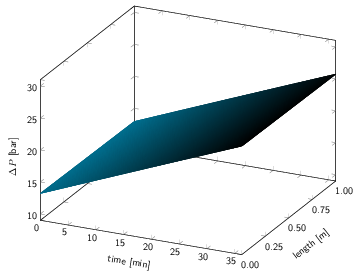
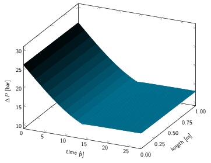
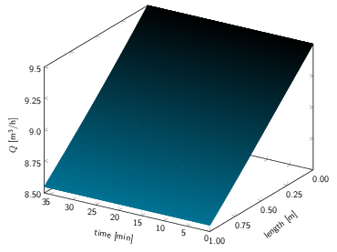
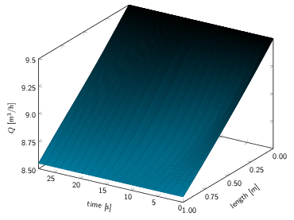

# Simulation and Optimization of Closed-Circuit Reverse Osmosis Systems and Associated Networks: Supplementary Material

#### Table of contents

1. [Network Optimization](#network-optimization)
    1. [More Details](#more-details)
    2. [Technologies, Tools and Main References](#technologies-tools-and-main-references)
    3. [Software](#software)
2. [Plant Simulation](#plant-simulation)
    1. [Technologies, Tools and Main References](#technologies-tools-and-main-references-1)
    2. [Software](#software-1)
    3. [Pressures and Flowrates](#pressures-and-flowrates)

## Network Optimization

### More Details

The legal requirements mentioned are legal demands for well downtime: SABESP is
required to interrupt extraction from each well for a certain number of
hours, daily. This period must be contiguous.

The ion of concern in the subterranean waters of the analyzed city is
Fluoride; hence, the model used its charge in each stream. Any other ion is
assumed to be either less dangerous or less concentrated; with split ratios
defined from the optimization, the concentration of any other ion in any point
of the system can be calculated.

### Technologies, Tools and Main References

* For logarithmic linearization of tanks and splitters, Kolodziej, Castro and
  Grossmann (2013) is our main reference
[](https://doi.org/10.1007/s10898-012-0022-1)

* The modeling language used in this work is [CasADi](https://web.casadi.org/)
[](https://doi.org/10.1007/s12532-018-0139-4)

* The three solvers used are [IPOPT](https://github.com/coin-or/Ipopt)
[](https://doi.org/10.1007/s10107-004-0559-y)
and [HiGHS](https://highs.dev/)
[](https://doi.org/10.1007/s12532-017-0130-5)
(open-source) and [GUROBI](https://www.gurobi.com/)
(proprietary), but the interface is solver agnostic

### Software

The model is implemented as a Python library, named `wd`; the user must
create each node (well, plant, population center, _etc._) in the network,
connect them, select the solver and its parameters and run it. An example of
script using this library is shown below:

```python
#! /usr/bin/env python3

# This file tests a very simple system that, nevertheless, still has all basic
# unit types (wells, mixers, splitters, treatment plants, tanks, concentrate
# discharges and consumers), shown below:
#
#                                 plant
#     P1-------\     /------------->O1-------->R1
#    well      |     |              |       discharge
#              V     |              |
#        mixer M1--->S1 splitter    |
#              A     |              |
#              |     |              V               consumers
#     P2-------/     \------------->M2------->T1------->C1
#    well                         mixer      tank

import wd

def polydemand(x):
    # This function takes an hour of the day as argument, and outputs
    # the value of the demand at that moment.
    return (-0.0001043*x**5
            +0.004664*x**4
            -0.04313*x**3
            -0.4956*x**2
            +6.661*x
            +2.972)

timesteps = 24
demand = []
for h in range(timesteps):
    demand.append(polydemand(24*h/timesteps))

model = wd.watnet_model.Model(timesteps=timesteps,
                              solver='highs',
                              program='MILP')

P1 = model.add_well('P1', 25.1, 1.75, downtime=0.24)
P2 = model.add_well('P2', 15.1, 0.95, downtime=0.24)

M1 = model.add_mixer('M1', ['P1', 'P2'])
M2 = model.add_mixer('M2', ['S1', 'O1'])

S1 = model.add_splitter('S1', ['O1', 'M2'])

O1 = model.add_plant('O1', 10.7,
                     tol_q=0.5,
                     salt_passage=0.01,
                     plant_yield=0.90,
                     downtime=0.16)

T1 = model.add_tank('T1', 100)

R1 = model.add_concentrate('R1')

C1 = model.add_consumer('C1', demand, 0.7, tol_f=0.1)

model.connection(P1, M1)
model.connection(P2, M1)
model.connection(M1, S1)
model.connection(S1, O1)
model.connection(S1, M2)
model.connection(O1, M2)
model.connection(O1, R1, from_concentrate=True)
model.connection(M2, T1)
model.connection(T1, C1)

model.solve([P1, P2], weights=[1,2], optimize='wells')

model.save_to_csv('simplest.csv', internal_filename='internal_simplest.csv')
```

## Plant Simulation

### Technologies, Tools and Main References

* [PHREEQC](https://www.usgs.gov/software/phreeqc-version-3)
[](https://doi.org/10.3133/tm6A43)
and its python interface, [PHREEQPy](https://phreeqpy.com/), were utilized for hydrochemical calculations (saturation indexes, ionic activity coefficients, _etc._)

* The membrane was modeled with a Partial Differential-Algebraic Equation
  (PDAE), derived from the work of Li (2023)
[](https://doi.org/10.1016/j.desal.2022.116149)

* The nucleation rates were calculated using Classical Nucleation Theory,
  as shown by Kügler & Kind (2018)
[](https://doi.org/10.1021/acs.cgd.7b01115)
  adopting homogeneous nucleation as the mechanism for inorganic fouling

### Software

The model was implemented as another Python Library, named `wp`. The user must
input feed composition, temperature, and pH, and must also supply information
about the membrane model. An example of script using this library is shown
below:

```python
#! /usr/bin/env python3
#
# This file simulates a closed-circuit reverse osmosis plant with the specified
# feed concentrations.
#

import wp

# Feed molar concentrations (mole/L) of each ion,
# besides pH and temperature in oC.
solution = wp.watpur_solution.Solution("CCRO feed",
                    {
                        'Ca+2':     245.75e-6,
                        'F-':       113.16e-6,
                        'K+':       416.87e-6,
                        'Na+':      16.478e-3,
                        'Mg+2':     62.963e-6,
                        'Sr+2':     6.0502e-6,
                        'CO3-2':    5.6983e-3,
                        'Cl-':      1.7824e-3,
                        'SO4-2':    4.9011e-3,
                        'temp':     27.0,
                        'pH':       6.4,
                    })

# Setting plant feed to our solution.
plant = wp.watpur_plant.Plant("CCRO", solution)

# Solving resulting PDAE.
plant.solve()

# Storing the results.
plant.store('concentration,F-', 'wp_fluoride.csv')
plant.store('concentration,Ca+2', 'wp_calcium.csv')
plant.store('flowrate', 'wp_flowrate.csv')
plant.store('pressure', 'wp_pressure.csv')
plant.store('accum', 'wp_accum.csv')
plant.store('misc', 'wp_misc.txt')
```

### Pressures and Flowrates

The poster figure shows only the behaviour of the concentration of an ion in the
concentrate as the plant operates. Exhibited below are the behaviours of
hydraulic pressure and flowrate in the feed channel.

#### Pressure: closed-circuit



#### Pressure: flushing concentrate



#### Flowrate: closed-circuit



#### Flowrate: flushing concentrate



